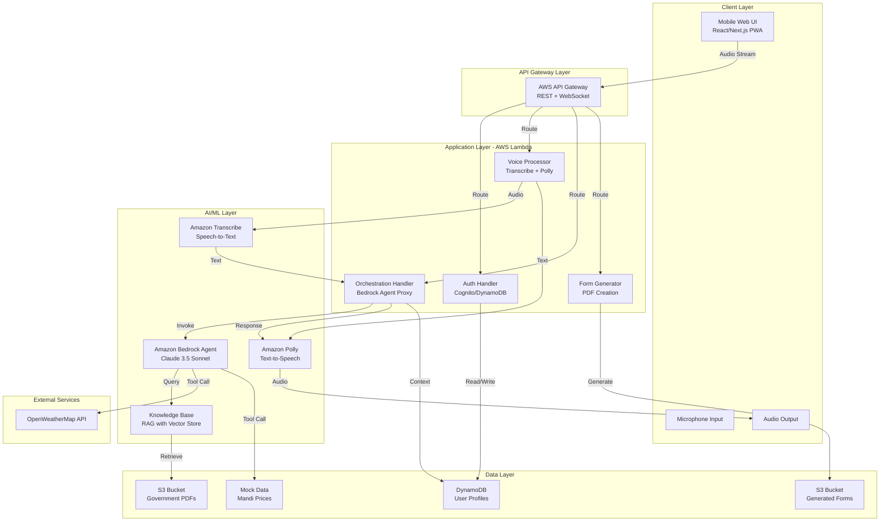

# Design Document: GramSetu (Village Bridge)

## Overview

GramSetu is a voice-first, multilingual AI agent platform designed to democratize access to government schemes, market intelligence, and financial services for rural farmers in India. The system addresses the critical "Information & Literacy Asymmetry" by enabling farmers to interact naturally through voice in their native languages (Hindi, Hinglish, Telugu, or Tamil), eliminating barriers created by low digital literacy and language constraints.

The architecture leverages AWS AI services to create a seamless voice-to-action pipeline: farmers speak their queries or provide information, the system processes the speech through Amazon Transcribe, orchestrates intelligent responses using Amazon Bedrock Agents with Claude 3.5 Sonnet, retrieves relevant information from a RAG-based knowledge base containing government scheme PDFs, and responds with natural voice output via Amazon Polly. The hero feature—voice-to-form filling—automatically extracts structured entities from conversational input and generates ready-to-submit PDF applications for schemes like Kisan Credit Card (KCC), dramatically simplifying the application process.

The MVP targets a mobile-first web application (PWA) with a WhatsApp-style interface, prioritizing simplicity with a prominent microphone button as the primary interaction point. The system supports both guest mode for information queries and authenticated mode (phone + simulated OTP) for scheme applications and profile persistence.

### Key Design Principles

1. **Voice-First, Text-Optional**: Minimize text input requirements; prioritize audio interaction throughout
2. **Conversational Intelligence**: Maintain context across multi-turn conversations; handle code-switching and colloquial speech
3. **Progressive Disclosure**: Start simple (guest mode) and add authentication only when needed (applications)
4. **Graceful Degradation**: Handle poor connectivity, API failures, and unclear speech with helpful fallbacks
5. **Privacy by Design**: Encrypt sensitive data, mask Aadhar numbers, avoid storing raw audio
6. **Mobile-Optimized Performance**: Fast responses (<3s), minimal data usage, works on low-end devices

## Architecture

### High-Level System Architecture



### Component Interaction Flow

**Information Query Flow (Guest Mode)**:
1. User taps microphone button and speaks query in Hindi
2. Frontend streams audio to API Gateway WebSocket
3. Voice Processor Lambda invokes Amazon Transcribe (streaming)
4. Transcribed text sent to Orchestration Handler
5. Orchestration Handler invokes Bedrock Agent with user query
6. Bedrock Agent searches Knowledge Base (RAG) for relevant scheme information
7. Bedrock Agent may invoke weather/price tools if needed
8. Bedrock Agent generates response text
9. Orchestration Handler sends text to Amazon Polly
10. Polly generates audio response
11. Audio streamed back to frontend and played

**Voice-to-Form Application Flow (Authenticated Mode)**:
1. User initiates KCC application ("I want to apply for Kisan Credit Card")
2. System checks authentication; if not authenticated, triggers phone OTP flow
3. After authentication, Bedrock Agent enters form-filling conversation mode
4. Agent prompts for required fields one by one
5. User provides information via voice (e.g., "My land is 5 acres")
6. Transcribe converts speech to text
7. Bedrock Agent extracts entities using Claude's NER capabilities
8. Agent confirms extracted values with user
9. Once all fields collected, Form Generator Lambda is invoked
10. Form Generator creates filled PDF from template
11. PDF uploaded to S3, download link returned to user
12. Application data saved to DynamoDB User Profile

## Components and Interfaces

### 1. Mobile Web UI (Frontend)

**Technology**: React with Next.js (or Streamlit/Gradio for rapid prototyping)

**Responsibilities**:
- Render WhatsApp-style conversation interface
- Capture microphone input and stream audio
- Display conversation history (user queries + AI responses)
- Play audio responses with controls (pause, replay)
- Handle authentication flow (phone number + OTP input)
- Display generated PDFs with download/share options
- Manage WebSocket connection for real-time streaming

**Key UI Components**:
- `MicrophoneButton`: Large, prominent button with recording indicator
- `ConversationView`: Scrollable message list with user/AI bubbles
- `AudioPlayer`: Playback controls for AI responses
- `AuthModal`: Phone number input and OTP verification
- `PDFViewer`: Display and download generated forms
- `LanguageSelector`: Choose preferred language (Hindi/Telugu/Tamil)

**Interface**:
```typescript
// WebSocket message format
interface VoiceMessage {
  type: 'audio_chunk' | 'audio_end' | 'text_query';
  sessionId: string;
  userId?: string;
  language: 'hi-IN' | 'te-IN' | 'ta-IN' | 'en-IN';
  data: string; // base64 audio or text
  timestamp: number;
}

interface AIResponse {
  type: 'text' | 'audio' | 'form_link' | 'error';
  content: string; // text or audio URL or PDF URL
  metadata?: {
    confidence?: number;
    sources?: string[];
    formId?: string;
  };
  timestamp: number;
}
```

### 2. API Gateway

**Technology**: AWS API Gateway (REST + WebSocket APIs)

**Responsibilities**:
- Route HTTP requests to appropriate Lambda functions
- Manage WebSocket connections for audio streaming
- Handle CORS for mobile web access
- Implement rate limiting and throttling
- Provide API authentication (API keys for MVP)

**Endpoints**:
- `POST /auth/send-otp`: Initiate phone authentication
- `POST /auth/verify-otp`: Verify OTP and create session
- `GET /user/profile`: Retrieve user profile
- `PUT /user/profile`: Update user profile
- `POST /voice/query`: Process voice query (REST fallback)
- `WS /voice/stream`: WebSocket for real-time audio streaming
- `POST /form/generate`: Generate PDF application
- `GET /form/{formId}`: Retrieve generated form

### 3. Authentication Handler (Lambda)

**Technology**: Python 3.11, boto3

**Responsibilities**:
- Generate simulated OTP (6-digit random number)
- Log OTP to CloudWatch for demo purposes
- Validate OTP against session store
- Create/retrieve user profiles from DynamoDB
- Generate session tokens (JWT)
- Handle guest mode (no auth required)

**Interface**:
```python
def send_otp(phone_number: str) -> dict:
    """
    Generate OTP and store in DynamoDB with 5-minute TTL.
    Returns: {"success": bool, "message": str}
    """
    pass

def verify_otp(phone_number: str, otp: str) -> dict:
    """
    Verify OTP and return session token.
    Returns: {"success": bool, "token": str, "userId": str}
    """
    pass

def get_user_profile(user_id: str) -> dict:
    """
    Retrieve user profile from DynamoDB.
    Returns: UserProfile object
    """
    pass
```

**Data Model**:
```python
class UserProfile:
    user_id: str  # UUID
    phone_number: str
    preferred_language: str  # 'hi-IN', 'te-IN', 'ta-IN'
    location: Optional[str]  # District name
    created_at: datetime
    last_active: datetime
    interaction_count: int
    saved_applications: List[str]  # Form IDs
```

### 4. Voice Processor (Lambda)

**Technology**: Python 3.11, boto3, Amazon Transcribe SDK, Amazon Polly SDK

**Responsibilities**:
- Stream audio to Amazon Transcribe for speech-to-text
- Handle language detection and code-switching
- Invoke Amazon Polly for text-to-speech conversion
- Optimize audio formats for mobile (MP3, low bitrate)
- Handle transcription errors and request retries

**Interface**:
```python
def transcribe_audio(
    audio_stream: bytes,
    language_code: str,
    session_id: str
) -> dict:
    """
    Transcribe audio using Amazon Transcribe streaming.
    Returns: {"text": str, "confidence": float, "language": str}
    """
    pass

def synthesize_speech(
    text: str,
    language_code: str,
    voice_id: str
) -> bytes:
    """
    Convert text to speech using Amazon Polly.
    Returns: Audio bytes (MP3 format)
    """
    pass
```

**Amazon Transcribe Configuration**:
- Streaming API with HTTP/2
- Language options: Hindi (hi-IN), Telugu (te-IN), Tamil (ta-IN), English (en-IN)
- Automatic language identification for Hinglish
- Vocabulary filtering for agricultural terms
- Confidence scores for quality assessment

**Amazon Polly Configuration**:
- Neural voices for natural speech:
  - Hindi: Aditi (bilingual en-IN/hi-IN)
  - Telugu: Use standard voice (neural not available)
  - Tamil: Use standard voice (neural not available)
- SSML support for emphasis and pacing
- Output format: MP3 at 24kbps for mobile optimization

### 5. Orchestration Handler (Lambda)

**Technology**: Python 3.11, boto3, Amazon Bedrock SDK

**Responsibilities**:
- Proxy requests to Amazon Bedrock Agent
- Manage conversation context and session state
- Handle tool invocation results (weather, prices)
- Implement retry logic for Bedrock API calls
- Track conversation flow for form-filling mode
- Store conversation history in DynamoDB

**Interface**:
```python
def invoke_agent(
    user_query: str,
    session_id: str,
    user_id: Optional[str],
    conversation_history: List[dict]
) -> dict:
    """
    Invoke Bedrock Agent with user query and context.
    Returns: {"response": str, "tool_calls": List, "next_action": str}
    """
    pass

def handle_tool_call(tool_name: str, parameters: dict) -> dict:
    """
    Execute tool calls (weather, prices, form generation).
    Returns: Tool execution result
    """
    pass
```

**Bedrock Agent Configuration**:
- Foundation Model: Anthropic Claude 3.5 Sonnet
- Agent Instructions: System prompt defining farmer assistant persona
- Action Groups: Weather lookup, price lookup, form generation
- Knowledge Base: Government scheme PDFs with RAG
- Guardrails: Content filtering, PII detection

### 6. Amazon Bedrock Agent

**Foundation Model**: Anthropic Claude 3.5 Sonnet (anthropic.claude-3-5-sonnet-20241022-v2:0)

**Agent Instructions (System Prompt)**:
```
You are GramSetu, a helpful AI assistant for rural farmers in India. Your goal is to help farmers access government schemes, market information, and complete application forms through natural conversation.

Guidelines:
- Speak in simple, clear language appropriate for farmers
- When users ask about schemes, search the knowledge base for accurate information
- Always cite the source document when providing scheme details
- For form filling, collect information one field at a time
- Confirm extracted information with the user before proceeding
- Be patient and supportive; many users have limited digital literacy
- Handle code-switching between Hindi and English naturally
- Provide actionable advice based on weather and market data

Available Tools:
- get_weather_forecast: Get weather data for a location
- get_mandi_prices: Get current market prices for crops
- generate_kcc_application: Generate Kisan Credit Card PDF application

Knowledge Base:
- Government scheme PDFs (PM-KISAN, Soil Health Card, SMAM, Fasal Bima Yojana)
```

**Action Groups**:

1. **Weather Tool**:
```python
def get_weather_forecast(district: str, days: int = 3) -> dict:
    """
    Get weather forecast from OpenWeatherMap API.
    Parameters:
      - district: Indian district name
      - days: Number of days (1-7)
    Returns: {
      "location": str,
      "current": {"temp": float, "condition": str, "humidity": int},
      "forecast": [{"date": str, "temp_max": float, "temp_min": float, "rain_probability": int}]
    }
    """
```

2. **Mandi Price Tool**:
```python
def get_mandi_prices(crop: str, state: Optional[str] = None) -> dict:
    """
    Get current mandi prices (synthetic data for MVP).
    Parameters:
      - crop: Crop name (wheat, rice, cotton, etc.)
      - state: Optional state filter
    Returns: {
      "crop": str,
      "prices": [{"mandi": str, "price_per_quintal": float, "date": str}],
      "trend": "rising" | "falling" | "stable"
    }
    """
```

3. **Form Generation Tool**:
```python
def generate_kcc_application(application_data: dict) -> dict:
    """
    Trigger KCC form generation.
    Parameters:
      - application_data: {
          "name": str,
          "aadhar": str,
          "land_size_acres": float,
          "crop_type": str,
          "loan_amount": float,
          "bank_name": Optional[str]
        }
    Returns: {
      "form_id": str,
      "download_url": str,
      "status": "generated"
    }
    """
```

### 7. Knowledge Base (RAG)

**Technology**: Amazon Bedrock Knowledge Bases with OpenSearch Serverless

**Responsibilities**:
- Store and index government scheme PDF documents
- Generate vector embeddings for semantic search
- Retrieve relevant document chunks for user queries
- Provide source attribution for responses

**Configuration**:
- Embedding Model: Amazon Titan Embeddings G1 - Text
- Vector Store: OpenSearch Serverless
- Chunking Strategy: Fixed-size chunks (300 tokens) with 20% overlap
- Metadata: Document name, scheme name, last updated date

**Data Sources** (S3 Bucket):
```
s3://gramsetu-knowledge-base/
├── pm-kisan/
│   ├── pm-kisan-guidelines-hindi.pdf
│   └── pm-kisan-guidelines-english.pdf
├── soil-health-card/
│   ├── shc-scheme-details.pdf
│   └── shc-application-process.pdf
├── smam/
│   ├── smam-subsidy-guidelines.pdf
│   └── smam-eligible-equipment.pdf
└── fasal-bima/
    ├── pmfby-guidelines.pdf
    └── pmfby-claim-process.pdf
```

**Query Process**:
1. User query converted to embedding vector
2. Semantic search across vector store (top-k=5)
3. Retrieved chunks ranked by relevance score
4. Chunks passed to Claude as context
5. Claude generates response with citations

### 8. Form Generator (Lambda)

**Technology**: Python 3.11, ReportLab (PDF generation), boto3

**Responsibilities**:
- Extract structured entities from conversation data
- Validate extracted data (format, completeness)
- Fill PDF template with extracted data
- Generate downloadable PDF application
- Upload PDF to S3 and return signed URL
- Save application metadata to DynamoDB

**Interface**:
```python
def extract_entities(conversation_history: List[dict]) -> dict:
    """
    Extract structured entities from conversation using Claude.
    Returns: {
      "entities": {
        "name": str,
        "aadhar": str,
        "land_size": float,
        "crop_type": str,
        "loan_amount": float
      },
      "confidence": float,
      "missing_fields": List[str]
    }
    """
    pass

def generate_kcc_pdf(application_data: dict, user_id: str) -> dict:
    """
    Generate filled KCC application PDF.
    Returns: {
      "form_id": str,
      "download_url": str,
      "expires_at": datetime
    }
    """
    pass
```

**Entity Extraction Strategy**:
- Use Claude's native NER capabilities via Bedrock
- Prompt engineering for Indian context (Aadhar format, crop names, land units)
- Confidence scoring for each extracted field
- Clarification prompts for low-confidence extractions
- Validation rules:
  - Aadhar: 12 digits, Luhn algorithm check
  - Land size: Positive number, reasonable range (0.1-100 acres)
  - Loan amount: Positive number, within KCC limits
  - Crop type: Match against known crop list

**PDF Template**:
- Based on official KCC application form format
- Fields: Name, Father's Name, Aadhar, Address, Land Details, Crop Type, Loan Amount, Bank Details
- Include QR code with application ID for tracking
- Watermark: "Generated by GramSetu"

### 9. DynamoDB Tables

**UserProfiles Table**:
```
Partition Key: user_id (String)
Attributes:
  - phone_number (String)
  - preferred_language (String)
  - location (String)
  - created_at (Number - Unix timestamp)
  - last_active (Number - Unix timestamp)
  - interaction_count (Number)
  - saved_applications (List of Strings)
```

**ConversationSessions Table**:
```
Partition Key: session_id (String)
Sort Key: timestamp (Number)
Attributes:
  - user_id (String)
  - message_type (String) - 'user' or 'ai'
  - content (String)
  - language (String)
  - tool_calls (List)
TTL: 24 hours
```

**OTPStore Table**:
```
Partition Key: phone_number (String)
Attributes:
  - otp (String)
  - created_at (Number)
  - attempts (Number)
TTL: 5 minutes
```

**Applications Table**:
```
Partition Key: form_id (String)
Attributes:
  - user_id (String)
  - application_type (String) - 'KCC'
  - application_data (Map)
  - pdf_url (String)
  - status (String) - 'generated', 'downloaded', 'submitted'
  - created_at (Number)
```

### 10. External Services

**OpenWeatherMap API**:
- Free tier: 1000 calls/day
- Endpoint: Current weather + 5-day forecast
- Location: District name → Geocoding API → Coordinates
- Response caching: 1 hour TTL

**Mock Mandi Price Service**:
- Static JSON file or DynamoDB table
- Sample data for major crops (wheat, rice, cotton, sugarcane, pulses)
- Price ranges based on real historical data
- Update mechanism for demo purposes

## Data Models

### User Profile
```python
from dataclasses import dataclass
from typing import List, Optional
from datetime import datetime

@dataclass
class UserProfile:
    user_id: str
    phone_number: str
    preferred_language: str  # 'hi-IN', 'te-IN', 'ta-IN', 'en-IN'
    location: Optional[str]  # District name
    created_at: datetime
    last_active: datetime
    interaction_count: int
    saved_applications: List[str]  # List of form_ids
    
    def to_dynamodb_item(self) -> dict:
        return {
            'user_id': self.user_id,
            'phone_number': self.phone_number,
            'preferred_language': self.preferred_language,
            'location': self.location or '',
            'created_at': int(self.created_at.timestamp()),
            'last_active': int(self.last_active.timestamp()),
            'interaction_count': self.interaction_count,
            'saved_applications': self.saved_applications
        }
```

### Conversation Message
```python
@dataclass
class ConversationMessage:
    session_id: str
    timestamp: datetime
    message_type: str  # 'user' or 'ai'
    content: str
    language: str
    audio_url: Optional[str]
    tool_calls: Optional[List[dict]]
    metadata: Optional[dict]
```

### Application Data
```python
@dataclass
class KCCApplication:
    form_id: str
    user_id: str
    applicant_name: str
    father_name: str
    aadhar_number: str
    address: str
    district: str
    state: str
    land_size_acres: float
    crop_type: str
    loan_amount: float
    bank_name: Optional[str]
    created_at: datetime
    pdf_url: str
    status: str  # 'generated', 'downloaded', 'submitted'
    
    def validate(self) -> tuple[bool, List[str]]:
        """Validate application data and return (is_valid, errors)"""
        errors = []
        
        # Aadhar validation
        if not self.aadhar_number.isdigit() or len(self.aadhar_number) != 12:
            errors.append("Aadhar must be 12 digits")
        
        # Land size validation
        if self.land_size_acres <= 0 or self.land_size_acres > 100:
            errors.append("Land size must be between 0.1 and 100 acres")
        
        # Loan amount validation
        if self.loan_amount <= 0 or self.loan_amount > 300000:
            errors.append("Loan amount must be between 1 and 300000 INR")
        
        return (len(errors) == 0, errors)
```

### Weather Data
```python
@dataclass
class WeatherForecast:
    location: str
    current_temp: float
    current_condition: str
    humidity: int
    forecast_days: List[dict]  # [{"date": str, "temp_max": float, "temp_min": float, "rain_prob": int}]
    
    def to_natural_language(self, language: str) -> str:
        """Convert weather data to natural language description"""
        # Implementation would use language-specific templates
        pass
```

### Mandi Price Data
```python
@dataclass
class MandiPrice:
    crop: str
    mandi_name: str
    state: str
    price_per_quintal: float
    date: str
    trend: str  # 'rising', 'falling', 'stable'
    
    @staticmethod
    def get_price_advice(prices: List['MandiPrice'], crop: str) -> str:
        """Generate advice based on price trends"""
        # Find best mandi, analyze trends
        pass
```

## Correctness Properties

*A property is a characteristic or behavior that should hold true across all valid executions of a system—essentially, a formal statement about what the system should do. Properties serve as the bridge between human-readable specifications and machine-verifiable correctness guarantees.*


### Property Reflection

After analyzing all acceptance criteria, I identified several areas where properties can be consolidated:

**Language Consistency Properties**: Requirements 2.6, 5.1, and 9.5 all relate to maintaining language consistency across the system. These can be combined into a single comprehensive property about language preservation throughout the interaction flow.

**Data Persistence Properties**: Requirements 3.7, 6.5, and 8.6 all relate to persisting user data. These can be consolidated into properties about data persistence for authenticated users.

**Entity Extraction and Validation**: Requirements 3.2 and 3.5 both relate to entity handling. The validation property subsumes basic extraction verification.

**Knowledge Base Operations**: Requirements 2.1 and 2.5 both relate to knowledge base queries. The citation property implies that a search was performed.

**Authentication Flow**: Requirements 6.3 and 6.4 form a sequence that can be tested as a single authentication round-trip property.

The following properties represent the unique, non-redundant correctness guarantees for GramSetu:

### Core Properties

**Property 1: Multilingual Transcription Support**

*For any* audio input in Hindi, Hinglish, Telugu, or Tamil with standard sampling rates (8kHz-48kHz), the Voice_Processor should successfully transcribe the audio to text and correctly identify the input language.

**Validates: Requirements 1.1, 1.4**

**Property 2: Knowledge Base Query with Citations**

*For any* scheme-related query, when the AI_Orchestrator searches the Knowledge_Base and finds relevant information, the response should include both the scheme details and a citation to the source document.

**Validates: Requirements 2.1, 2.5**

**Property 3: Response Language Consistency**

*For any* user query in a specific language (Hindi, Telugu, Tamil, or English), all system responses (text and voice) and error messages should be in that same language throughout the conversation session.

**Validates: Requirements 2.6, 5.1, 9.5**

**Property 4: Scheme Information Completeness**

*For any* scheme information response, the AI_Orchestrator should include eligibility criteria, benefits, and application process information when available in the knowledge base.

**Validates: Requirements 2.2**

**Property 5: Entity Extraction from Voice Input**

*For any* voice input containing structured information (name, numbers, locations, crop types), the Form_Generator should extract the entities and structure them into the appropriate data fields.

**Validates: Requirements 3.2**

**Property 6: Entity Validation Rules**

*For any* extracted entity data, the Form_Generator should validate it according to defined rules (Aadhar: 12 digits, land size: positive number 0.1-100 acres, loan amount: positive number up to 300000 INR), and reject invalid data.

**Validates: Requirements 3.5**

**Property 7: PDF Generation with Complete Data**

*For any* KCC application with all required fields collected (name, Aadhar, land size, crop type, loan amount), the Form_Generator should generate a valid PDF containing all provided field values.

**Validates: Requirements 3.3, 3.6**

**Property 8: Application Persistence for Authenticated Users**

*For any* completed application by an authenticated user, the application data and PDF URL should be saved to the User_Profile and retrievable in future sessions.

**Validates: Requirements 3.7, 6.5**

**Property 9: Data Retrieval for Market and Weather Queries**

*For any* query about mandi prices or weather, the GramSetu_System should invoke the appropriate data source (price API or weather API) and return formatted data in INR/quintal for prices and Celsius for temperature.

**Validates: Requirements 4.1, 4.2, 4.6**

**Property 10: Location Handling for Weather Queries**

*For any* weather query without explicit location, the GramSetu_System should either request the user's district or use the saved profile location if available.

**Validates: Requirements 4.5**

**Property 11: Authentication Requirement for Applications**

*For any* attempt to initiate a scheme application (KCC, PM-KISAN, etc.), the GramSetu_System should require authentication via mobile number and OTP before proceeding with form collection.

**Validates: Requirements 6.2**

**Property 12: OTP Authentication Round-Trip**

*For any* mobile number provided for authentication, the system should generate an OTP, and when the correct OTP is entered, should create or retrieve a User_Profile with the phone number.

**Validates: Requirements 6.3, 6.4**

**Property 13: User Profile Completeness**

*For any* User_Profile created or retrieved, it should contain phone_number, preferred_language, location (optional), created_at, last_active, interaction_count, and saved_applications fields.

**Validates: Requirements 6.5**

**Property 14: Returning User Personalization**

*For any* authenticated user returning to the system, the GramSetu_System should greet them using their profile information and restore their conversation context from previous sessions.

**Validates: Requirements 6.6**

**Property 15: Profile Update via Voice**

*For any* voice command to update profile information (language preference, location), the GramSetu_System should extract the update intent, apply the changes to the User_Profile, and confirm the update to the user.

**Validates: Requirements 6.7**

**Property 16: Conversation Context Preservation**

*For any* multi-turn conversation within a session, the AI_Orchestrator should maintain context such that follow-up questions with pronouns or implicit references can be resolved using conversation history.

**Validates: Requirements 8.1, 8.2**

**Property 17: Topic Tracking and Switching**

*For any* conversation, the AI_Orchestrator should track the current topic (scheme inquiry, form filling, market prices, weather), and when the user switches topics, should explicitly acknowledge the change.

**Validates: Requirements 8.3, 8.4**

**Property 18: Topic Navigation**

*For any* conversation session, users should be able to reference and return to previous topics discussed earlier in the session.

**Validates: Requirements 8.5**

**Property 19: Session Data Persistence**

*For any* authenticated user session that ends, key conversation points (topics discussed, schemes queried, applications started) should be saved to the User_Profile for future reference.

**Validates: Requirements 8.6**

**Property 20: Aadhar Number Masking**

*For any* Aadhar number displayed in the UI or spoken in voice responses, only the last 4 digits should be shown/spoken, with the first 8 digits masked.

**Validates: Requirements 10.3**

**Property 21: Audio Data Non-Persistence**

*For any* audio input processed by the Voice_Processor, the raw audio data should not be stored or logged after transcription is complete.

**Validates: Requirements 10.4**

**Property 22: User Data Deletion**

*For any* user data deletion request, all associated User_Profile data, conversation history, and application records should be removed from all storage systems.

**Validates: Requirements 10.6**

**Property 23: Knowledge Base Auto-Indexing**

*For any* PDF document uploaded to the designated S3 bucket, the Knowledge_Base should automatically detect, process, and index the document for semantic search.

**Validates: Requirements 12.1**

**Property 24: Document Version Tracking**

*For any* scheme document in the Knowledge_Base, the system should maintain version history such that updates can be tracked and previous versions can be referenced.

**Validates: Requirements 12.3**

**Property 25: Hot-Reload of Updated Documents**

*For any* document update in the Knowledge_Base, the new information should become available for queries without requiring system restart or manual reindexing.

**Validates: Requirements 12.5**

## Error Handling

### Error Categories and Strategies

**1. Voice Processing Errors**

*Transcription Failures*:
- **Cause**: Poor audio quality, background noise, unsupported language
- **Detection**: Low confidence scores from Transcribe (<0.6), empty transcription
- **Handling**: 
  - Voice response: "I couldn't hear you clearly. Please try again."
  - Visual indicator: Show retry button
  - Retry limit: 3 attempts, then offer text input fallback
- **Logging**: Log confidence scores and audio metadata for debugging

*Speech Synthesis Failures*:
- **Cause**: Polly API errors, invalid SSML, unsupported characters
- **Detection**: Exception from Polly API
- **Handling**:
  - Fallback: Display text response without audio
  - Retry: Attempt synthesis with plain text (no SSML)
  - User notification: "Audio unavailable, showing text response"
- **Logging**: Log Polly errors and problematic text

**2. AI Orchestration Errors**

*Bedrock Agent Timeouts*:
- **Cause**: Complex queries, slow knowledge base, high load
- **Detection**: Timeout after 30 seconds
- **Handling**:
  - Immediate response: "I'm thinking... this is taking longer than usual"
  - Fallback: Provide generic response with apology
  - Retry: Offer to try again with simplified query
- **Logging**: Log query complexity metrics

*Knowledge Base Query Failures*:
- **Cause**: OpenSearch unavailable, indexing in progress, malformed query
- **Detection**: Exception from Knowledge Base API
- **Handling**:
  - Fallback response: "I'm having trouble accessing scheme information right now"
  - Alternative: Suggest trying again or asking a different question
  - Graceful degradation: Use cached responses if available
- **Logging**: Log KB errors and query patterns

*Tool Invocation Failures*:
- **Cause**: External API down (weather, prices), invalid parameters
- **Detection**: HTTP errors, timeouts from external services
- **Handling**:
  - Weather failure: "Weather information is unavailable right now"
  - Price failure: "Market prices are unavailable, please try again later"
  - Continue conversation: Don't block other functionality
- **Logging**: Log external API failures with timestamps

**3. Form Generation Errors**

*Entity Extraction Failures*:
- **Cause**: Ambiguous input, missing information, unclear speech
- **Detection**: Low confidence scores (<0.7), missing required fields
- **Handling**:
  - Clarification questions: "Did you say 5 acres or 15 acres?"
  - Confirmation: Repeat extracted values for user verification
  - Retry: Ask for information again if confidence is very low
- **Logging**: Log extraction confidence and user corrections

*Validation Errors*:
- **Cause**: Invalid Aadhar format, out-of-range values, missing required fields
- **Detection**: Validation rules in KCCApplication.validate()
- **Handling**:
  - Specific feedback: "Aadhar number must be 12 digits"
  - Re-prompt: Ask for correct value
  - Examples: Provide valid format examples
- **Logging**: Log validation failures and user corrections

*PDF Generation Failures*:
- **Cause**: ReportLab errors, S3 upload failures, template issues
- **Detection**: Exception during PDF creation or upload
- **Handling**:
  - Retry: Attempt generation up to 3 times
  - Fallback: Offer to save data and generate later
  - User notification: "Unable to generate PDF, your data is saved"
- **Logging**: Log PDF generation errors with application data

**4. Authentication Errors**

*OTP Generation Failures*:
- **Cause**: DynamoDB unavailable, rate limiting
- **Detection**: Exception from DynamoDB
- **Handling**:
  - Retry: Attempt generation again
  - Fallback: Allow guest mode continuation
  - User notification: "Authentication unavailable, you can browse schemes without logging in"
- **Logging**: Log auth failures and retry attempts

*OTP Verification Failures*:
- **Cause**: Incorrect OTP, expired OTP, too many attempts
- **Detection**: OTP mismatch, TTL expired, attempt count exceeded
- **Handling**:
  - Incorrect OTP: "Incorrect code, please try again" (3 attempts)
  - Expired OTP: "Code expired, request a new one"
  - Too many attempts: "Too many attempts, please wait 5 minutes"
- **Logging**: Log verification attempts and failure reasons

**5. Data Persistence Errors**

*DynamoDB Write Failures*:
- **Cause**: DynamoDB unavailable, throttling, invalid data
- **Detection**: Exception from DynamoDB put/update operations
- **Handling**:
  - Retry: Exponential backoff (3 attempts)
  - Fallback: Store in local cache, sync later
  - User notification: "Your data is saved locally and will sync when connection improves"
- **Logging**: Log write failures and retry attempts

*S3 Upload Failures*:
- **Cause**: S3 unavailable, network issues, permission errors
- **Detection**: Exception from S3 put operation
- **Handling**:
  - Retry: Attempt upload up to 3 times
  - Fallback: Store locally and provide manual upload option
  - User notification: "Unable to upload document, please try again"
- **Logging**: Log S3 errors and file metadata

### Error Response Templates

All error responses should follow these principles:
1. **Language-appropriate**: Use user's selected language
2. **Actionable**: Tell user what to do next
3. **Empathetic**: Acknowledge frustration, apologize when appropriate
4. **Concise**: Keep messages short and clear

**Example Error Templates** (Hindi):

```python
ERROR_TEMPLATES = {
    'hi-IN': {
        'transcription_failed': 'मुझे आपकी बात समझ नहीं आई। कृपया फिर से बोलें।',
        'kb_unavailable': 'मुझे योजना की जानकारी लेने में समस्या हो रही है। कृपया थोड़ी देर बाद प्रयास करें।',
        'weather_unavailable': 'मौसम की जानकारी अभी उपलब्ध नहीं है।',
        'price_unavailable': 'मंडी के भाव अभी उपलब्ध नहीं हैं।',
        'auth_failed': 'प्रमाणीकरण में समस्या हुई। कृपया फिर से प्रयास करें।',
        'pdf_failed': 'आवेदन पत्र बनाने में समस्या हुई। आपका डेटा सुरक्षित है।',
        'generic_error': 'कुछ गलत हो गया। कृपया फिर से प्रयास करें।'
    },
    'en-IN': {
        'transcription_failed': 'I couldn\'t understand you clearly. Please try again.',
        'kb_unavailable': 'I\'m having trouble accessing scheme information. Please try again later.',
        'weather_unavailable': 'Weather information is currently unavailable.',
        'price_unavailable': 'Market prices are currently unavailable.',
        'auth_failed': 'Authentication failed. Please try again.',
        'pdf_failed': 'Unable to generate application form. Your data is saved.',
        'generic_error': 'Something went wrong. Please try again.'
    }
}
```

### Circuit Breaker Pattern

For external service calls (Weather API, Bedrock, Knowledge Base), implement circuit breaker pattern:

```python
class CircuitBreaker:
    def __init__(self, failure_threshold=5, timeout=60):
        self.failure_count = 0
        self.failure_threshold = failure_threshold
        self.timeout = timeout
        self.last_failure_time = None
        self.state = 'CLOSED'  # CLOSED, OPEN, HALF_OPEN
    
    def call(self, func, *args, **kwargs):
        if self.state == 'OPEN':
            if time.time() - self.last_failure_time > self.timeout:
                self.state = 'HALF_OPEN'
            else:
                raise CircuitBreakerOpenError("Service unavailable")
        
        try:
            result = func(*args, **kwargs)
            if self.state == 'HALF_OPEN':
                self.state = 'CLOSED'
                self.failure_count = 0
            return result
        except Exception as e:
            self.failure_count += 1
            self.last_failure_time = time.time()
            if self.failure_count >= self.failure_threshold:
                self.state = 'OPEN'
            raise e
```

## Testing Strategy

### Dual Testing Approach

GramSetu requires both **unit tests** for specific examples and edge cases, and **property-based tests** for universal correctness guarantees. Together, these provide comprehensive coverage:

- **Unit tests**: Verify specific scenarios, edge cases, integration points, and error conditions
- **Property tests**: Verify universal properties hold across all inputs through randomization

### Property-Based Testing Configuration

**Framework**: Hypothesis (Python)

**Configuration**:
- Minimum 100 iterations per property test (due to randomization)
- Each property test references its design document property
- Tag format: `# Feature: gramsetu, Property {number}: {property_text}`

**Example Property Test Structure**:

```python
from hypothesis import given, strategies as st
import pytest

# Feature: gramsetu, Property 3: Response Language Consistency
@given(
    query_language=st.sampled_from(['hi-IN', 'te-IN', 'ta-IN', 'en-IN']),
    query_text=st.text(min_size=10, max_size=100)
)
@pytest.mark.property_test
def test_response_language_consistency(query_language, query_text):
    """
    For any user query in a specific language, all system responses
    should be in that same language throughout the conversation.
    """
    # Setup: Create session with specified language
    session = create_test_session(language=query_language)
    
    # Execute: Send query and get response
    response = orchestrator.process_query(query_text, session)
    
    # Verify: Response language matches query language
    assert response.language == query_language
    assert detect_language(response.text) == query_language
    
    # Verify: Voice output language matches
    audio_response = voice_processor.synthesize(response.text, query_language)
    assert audio_response.language_code == query_language
```

### Unit Testing Strategy

**Framework**: pytest

**Coverage Areas**:

1. **Voice Processing**:
   - Test specific audio samples for each supported language
   - Test edge cases: empty audio, very short audio, very long audio
   - Test error handling: invalid format, corrupted audio
   - Mock Amazon Transcribe and Polly for deterministic tests

2. **Entity Extraction**:
   - Test specific examples: "My land is 5 acres", "Aadhar number 1234 5678 9012"
   - Test edge cases: ambiguous numbers, missing units, multiple entities
   - Test validation: invalid Aadhar, negative land size, excessive loan amount
   - Mock Claude API for deterministic extraction

3. **Form Generation**:
   - Test PDF generation with complete data
   - Test PDF generation with minimal required data
   - Test validation errors for each field type
   - Verify PDF structure and content

4. **Authentication**:
   - Test OTP generation and verification flow
   - Test OTP expiration (TTL)
   - Test rate limiting (too many attempts)
   - Test guest mode access

5. **Knowledge Base Integration**:
   - Test specific scheme queries with known documents
   - Test citation extraction
   - Test "no results" scenario
   - Mock Bedrock Knowledge Base for deterministic tests

6. **External API Integration**:
   - Test weather API with specific locations
   - Test price API with specific crops
   - Test error handling for API failures
   - Use VCR.py for recording/replaying API responses

### Integration Testing

**Scope**: End-to-end flows across multiple components

**Key Flows to Test**:

1. **Guest Information Query Flow**:
   - User speaks query → Transcribe → Bedrock → Knowledge Base → Polly → Audio response
   - Verify: Complete flow works, response is relevant, audio is generated

2. **Authenticated Application Flow**:
   - User initiates application → Auth required → OTP flow → Form filling → PDF generation
   - Verify: Authentication works, all fields collected, PDF generated and saved

3. **Multi-Turn Conversation Flow**:
   - User asks about scheme → Follow-up question → Apply for scheme → Complete application
   - Verify: Context maintained, topic tracking works, application completed

4. **Error Recovery Flow**:
   - Trigger various errors (API failure, transcription failure, validation error)
   - Verify: Appropriate error messages, retry mechanisms, graceful degradation

### Test Data Strategy

**Synthetic Data**:
- Generate realistic farmer profiles with Indian names, phone numbers, locations
- Generate realistic crop types, land sizes, loan amounts
- Generate realistic scheme queries in multiple languages

**Mock Data**:
- Mock mandi prices: Static JSON with realistic price ranges
- Mock weather data: Predefined forecasts for test locations
- Mock government PDFs: Sample scheme documents for testing

**Test Fixtures**:
```python
@pytest.fixture
def sample_user_profile():
    return UserProfile(
        user_id='test-user-123',
        phone_number='+919876543210',
        preferred_language='hi-IN',
        location='Amravati',
        created_at=datetime.now(),
        last_active=datetime.now(),
        interaction_count=5,
        saved_applications=[]
    )

@pytest.fixture
def sample_kcc_application():
    return KCCApplication(
        form_id='kcc-test-001',
        user_id='test-user-123',
        applicant_name='राम कुमार',
        father_name='श्याम कुमार',
        aadhar_number='123456789012',
        address='गाँव पोस्ट: रामपुर',
        district='Amravati',
        state='Maharashtra',
        land_size_acres=5.0,
        crop_type='Cotton',
        loan_amount=50000.0,
        bank_name='State Bank of India',
        created_at=datetime.now(),
        pdf_url='',
        status='generated'
    )
```

### Performance Testing

**Load Testing**:
- Use Locust to simulate concurrent users
- Target: 100 concurrent users without degradation
- Measure: Response times, error rates, throughput

**Stress Testing**:
- Test system behavior under extreme load
- Identify breaking points
- Verify graceful degradation

**Latency Testing**:
- Measure end-to-end latency for each flow
- Target: <3s for simple queries, <5s for form generation
- Identify bottlenecks

### Continuous Integration

**CI Pipeline** (GitHub Actions):
1. Run unit tests on every commit
2. Run property tests on every PR
3. Run integration tests on main branch
4. Generate coverage reports (target: >80%)
5. Run linting and type checking
6. Deploy to staging on successful tests

**Test Organization**:
```
tests/
├── unit/
│   ├── test_voice_processor.py
│   ├── test_entity_extraction.py
│   ├── test_form_generator.py
│   ├── test_authentication.py
│   └── test_orchestrator.py
├── property/
│   ├── test_language_consistency.py
│   ├── test_entity_validation.py
│   ├── test_conversation_context.py
│   └── test_data_persistence.py
├── integration/
│   ├── test_guest_query_flow.py
│   ├── test_application_flow.py
│   └── test_error_recovery.py
├── fixtures/
│   ├── user_profiles.py
│   ├── applications.py
│   └── mock_data.py
└── conftest.py
```

### Test Execution

**Local Development**:
```bash
# Run all tests
pytest

# Run only unit tests
pytest tests/unit/

# Run only property tests
pytest tests/property/ -m property_test

# Run with coverage
pytest --cov=src --cov-report=html

# Run specific property test with verbose output
pytest tests/property/test_language_consistency.py -v -s
```

**CI Environment**:
```bash
# Run tests with strict settings
pytest --strict-markers --tb=short

# Run property tests with more iterations
pytest tests/property/ --hypothesis-profile=ci

# Generate coverage report
pytest --cov=src --cov-report=xml --cov-fail-under=80
```

### Monitoring and Observability

**Metrics to Track**:
- Transcription accuracy (confidence scores)
- Entity extraction accuracy (user corrections)
- Knowledge Base query relevance (user feedback)
- API latency (p50, p95, p99)
- Error rates by category
- User session duration
- Application completion rate

**Logging Strategy**:
- Structured logging (JSON format)
- Log levels: DEBUG, INFO, WARNING, ERROR, CRITICAL
- Include: session_id, user_id, timestamp, component, action, metadata
- Sensitive data: Mask Aadhar, phone numbers in logs

**Alerting**:
- Alert on error rate >5%
- Alert on API latency >5s (p95)
- Alert on transcription confidence <0.6 for >10% of requests
- Alert on external API failures (circuit breaker open)

---

## Summary

This design document provides a comprehensive blueprint for GramSetu, a voice-first AI agent for rural farmers in India. The architecture leverages AWS AI services (Transcribe, Bedrock, Polly, Knowledge Bases) to create a seamless voice-to-action pipeline that eliminates language and literacy barriers.

Key design decisions include:
- Mobile-first PWA with WhatsApp-style interface
- Voice-first interaction with minimal text input
- Progressive authentication (guest mode → phone OTP)
- RAG-based knowledge base for government schemes
- Voice-to-form filling with entity extraction
- Comprehensive error handling and graceful degradation
- Dual testing approach (unit + property-based tests)

The 25 correctness properties defined in this document provide formal specifications for the system's behavior, ensuring that critical functionality (language consistency, data persistence, entity validation, conversation context) works correctly across all inputs. These properties will be implemented as property-based tests using Hypothesis, with each test running a minimum of 100 iterations to verify correctness through randomization.

The system is designed for scalability, security, and performance, with clear error handling strategies, circuit breakers for external services, and comprehensive monitoring. The MVP focuses on Hindi/Hinglish and one regional language (Telugu or Tamil), with the Kisan Credit Card (KCC) application as the hero feature demonstrating voice-to-form filling capabilities.
